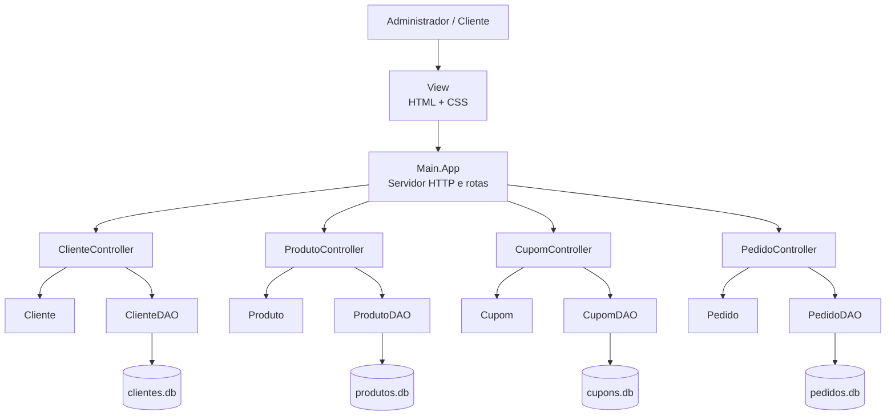

# Arquitetura Proposta

## 1. Padrao arquitetural
O projeto foi estruturado de acordo com o padrao **MVC + DAO**, conforme solicitado no enunciado.

As responsabilidades foram separadas da seguinte forma:
- **Model**: classes de dominio e serializacao dos registros.
- **DAO**: leitura e gravacao em arquivos binarios.
- **Controller**: regras de negocio e validacoes.
- **View**: interface HTML/CSS gerada para acesso via navegador.
- **Main**: inicializacao do servidor HTTP e mapeamento das rotas.

## 2. Estrutura do projeto
- `Model/`
  - `Cliente.java`
  - `Produto.java`
  - `Pedido.java`
  - `Cupom.java`
  - `Registro.java`
- `DAO/`
  - `ArquivoDAO.java`
  - `ClienteDAO.java`
  - `ProdutoDAO.java`
  - `PedidoDAO.java`
  - `CupomDAO.java`
  - `RegistroFactory.java`
- `Controller/`
  - `ClienteController.java`
  - `ProdutoController.java`
  - `PedidoController.java`
  - `CupomController.java`
- `View/`
  - `HtmlView.java`
- `Main/`
  - `App.java`
- `data/`
  - `clientes.db`
  - `produtos.db`
  - `pedidos.db`
  - `cupons.db`

## 3. Persistencia em arquivos binarios
Cada arquivo binario possui:
- **Cabecalho de 4 bytes (`int`)** para armazenar o ultimo ID gerado.
- **Lapide (`boolean`)** para indicar se o registro esta ativo ou excluido logicamente.
- **Tamanho do payload (`int`)** para identificar a quantidade de bytes do registro.
- **Payload (`byte[]`)** com os dados serializados da entidade.

Formato logico de armazenamento:
```text
[cabecalho: ultimoId]
[lapide][tamanho][payload]
[lapide][tamanho][payload]
[lapide][tamanho][payload]
...
```

## 4. Regras de negocio implementadas
- O cadastro de clientes, produtos e cupons gera IDs automaticamente.
- A leitura por ID ignora registros com lapide.
- A listagem retorna apenas registros ativos.
- A exclusao logica apenas marca o registro como removido.
- A atualizacao pode ocorrer no mesmo espaco ou com realocacao no final do arquivo.
- O pedido valida a existencia do cliente.
- O pedido valida a existencia dos produtos e o estoque disponivel.
- O pedido reduz o estoque no momento da compra.
- O cupom so pode ser associado se estiver ativo.
- O valor total do pedido e recalculado com desconto na associacao do cupom.

## 5. Diagrama de arquitetura em camadas


## 6. Fluxo geral da aplicacao
1. O usuario acessa a interface pelo navegador.
2. O `Main.App` recebe a requisicao HTTP.
3. A rota chama o controller correspondente.
4. O controller aplica validacoes e regras de negocio.
5. O DAO realiza a leitura ou escrita no arquivo binario.
6. A resposta HTML e devolvida ao navegador.

## 7. Justificativa da arquitetura
O uso de **MVC + DAO** facilita a organizacao do projeto, separando interface, regras e persistencia. Isso torna o codigo mais legivel, mais facil de manter e aderente ao que foi pedido no trabalho.
