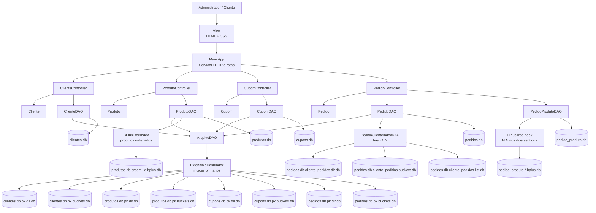

# Arquitetura Proposta

## 1. Padrao arquitetural
O projeto foi estruturado de acordo com o padrao **MVC + DAO**, conforme solicitado no enunciado.

As responsabilidades foram separadas da seguinte forma:
- **Model**: classes de dominio e serializacao dos registros.
- **DAO**: leitura e gravacao em arquivos binarios.
- **Controller**: regras de negocio e validacoes.
- **View**: interface HTML/CSS gerada para acesso via navegador.
- **Main**: inicializacao do servidor HTTP e mapeamento das rotas.

## 2. Estrutura do projeto
- `Model/`
  - `Cliente.java`
  - `Produto.java`
  - `Pedido.java`
  - `Cupom.java`
  - `PedidoProduto.java`
  - `Registro.java`
- `DAO/`
  - `ArquivoDAO.java`
  - `ClienteDAO.java`
  - `ProdutoDAO.java`
  - `PedidoDAO.java`
  - `CupomDAO.java`
  - `PedidoProdutoDAO.java`
  - `BPlusTreeIndex.java`
  - `RegistroFactory.java`
- `Controller/`
  - `ClienteController.java`
  - `ProdutoController.java`
  - `PedidoController.java`
  - `CupomController.java`
- `View/`
  - `HtmlView.java`
- `Main/`
  - `App.java`
- `data/`
  - `clientes.db`
  - `produtos.db`
  - `cupons.db`
  - `pedidos.db`
  - `pedido_produto.db`

## 3. Persistencia em arquivos binarios
Cada arquivo binario possui:
- **Cabecalho de 4 bytes (`int`)** para armazenar o ultimo ID gerado.
- **Lapide (`boolean`)** para indicar se o registro esta ativo ou excluido logicamente.
- **Tamanho do payload (`int`)** para identificar a quantidade de bytes do registro.
- **Payload (`byte[]`)** com os dados serializados da entidade.

Formato logico de armazenamento:
```text
[cabecalho: ultimoId]
[lapide][tamanho][payload]
[lapide][tamanho][payload]
[lapide][tamanho][payload]
...
```

## 4. Regras de negocio implementadas
- O cadastro de clientes, produtos e cupons gera IDs automaticamente.
- A leitura por ID ignora registros com lapide.
- A listagem retorna apenas registros ativos.
- A exclusao logica apenas marca o registro como removido.
- A atualizacao pode ocorrer no mesmo espaco ou com realocacao no final do arquivo.
- O pedido valida a existencia do cliente.
- O pedido valida a existencia dos produtos e o estoque disponivel.
- O pedido exige listas de produtos e quantidades com mesmo tamanho.
- O pedido reduz o estoque no momento da compra.
- O cupom so pode ser associado se estiver ativo.
- O pedido nao aceita um segundo cupom.
- O valor total do pedido e recalculado com desconto na associacao do cupom.
- Os itens sao persistidos em `PedidoProduto`, com PK composta `(idPedido, idProduto)`.
- A exclusao de pedido remove logicamente seus itens e devolve estoque.
- Um produto associado a pedido ativo nao pode ser excluido.

## 5. Interface e rotas principais
- `GET /`: pagina inicial.
- `GET /clientes`: tela de clientes.
- `POST /clientes/create`, `/clientes/update`, `/clientes/delete`, `/clientes/find`.
- `GET /produtos`: tela de produtos.
- `POST /produtos/create`, `/produtos/update`, `/produtos/delete`, `/produtos/find`.
- `GET /cupons`: tela de cupons.
- `POST /cupons/create`, `/cupons/update`, `/cupons/delete`, `/cupons/find`.
- `GET /pedidos`: tela de pedidos.
- `POST /pedidos/create`, `/pedidos/associar-cupom`, `/pedidos/delete`, `/pedidos/find`.
- `POST /pedidos/itens`, `/pedidos/by-produto`: navegacao N:N nos dois sentidos.
- `GET /styles.css`: folha de estilo servida pela aplicacao.

## 6. Diagrama de arquitetura em camadas

```mermaid
flowchart TD
    U[Administrador / Cliente] --> V[View<br/>HTML + CSS]
    V --> A[Main.App<br/>Servidor HTTP e rotas]

    A --> CC[ClienteController]
    A --> PC[ProdutoController]
    A --> CuC[CupomController]
    A --> PeC[PedidoController]

    CC --> M1[Cliente]
    PC --> M2[Produto]
    CuC --> M3[Cupom]
    PeC --> M4[Pedido]

    CC --> D1[ClienteDAO]
    PC --> D2[ProdutoDAO]
    CuC --> D3[CupomDAO]
    PeC --> D4[PedidoDAO]
    PeC --> D5[PedidoProdutoDAO]

    D1 --> A1[ArquivoDAO]
    D2 --> A1
    D3 --> A1
    D4 --> A1
    D5 --> B1[BPlusTreeIndex<br/>N:N nos dois sentidos]
    D2 --> B2[BPlusTreeIndex<br/>produtos ordenados]

    A1 --> H1[ExtensibleHashIndex<br/>indices primarios]
    D4 --> R1[PedidoClienteIndexDAO<br/>hash 1:N]

    D1 --> F1[(clientes.db)]
    D2 --> F2[(produtos.db)]
    D3 --> F3[(cupons.db)]
    D4 --> F4[(pedidos.db)]
    D5 --> F5[(pedido_produto.db)]

    H1 --> I1[(clientes.db.pk.dir.db)]
    H1 --> I2[(clientes.db.pk.buckets.db)]
    H1 --> I3[(produtos.db.pk.dir.db)]
    H1 --> I4[(produtos.db.pk.buckets.db)]
    H1 --> I5[(cupons.db.pk.dir.db)]
    H1 --> I6[(cupons.db.pk.buckets.db)]
    H1 --> I7[(pedidos.db.pk.dir.db)]
    H1 --> I8[(pedidos.db.pk.buckets.db)]

    R1 --> R2[(pedidos.db.cliente_pedidos.dir.db)]
    R1 --> R3[(pedidos.db.cliente_pedidos.buckets.db)]
    R1 --> R4[(pedidos.db.cliente_pedidos.list.db)]
    B1 --> B3[(pedido_produto.*.bplus.db)]
    B2 --> B4[(produtos.db.ordem_id.bplus.db)]
```

## 6.1 Refinamento da Fase II
O diagrama foi refinado para evidenciar componentes que se tornaram obrigatorios nesta fase:
- indices primarios persistidos em disco para todas as entidades;
- `ExtensibleHashIndex` como estrutura reutilizada pelos DAOs;
- `PedidoClienteIndexDAO` como estrutura de acesso ao relacionamento `Cliente 1:N Pedido`;
- arquivos especificos do relacionamento, separados dos arquivos principais de dados.

## 7. Fluxo geral da aplicacao
1. O usuario acessa a interface pelo navegador.
2. O `Main.App` recebe a requisicao HTTP.
3. A rota chama o controller correspondente.
4. O controller aplica validacoes e regras de negocio.
5. O DAO realiza a leitura ou escrita no arquivo binario.
6. A resposta HTML e devolvida ao navegador.

## 7.1 Evolucao da Fase III
`PedidoProdutoDAO` implementa a tabela associativa real entre `Pedido` e `Produto`.
O arquivo segue o formato de cabecalho, lapide, tamanho e payload adotado nas
outras tabelas. Duas Arvores B+ persistidas indexam as composicoes
`(idPedido, idProduto)` e `(idProduto, idPedido)`, permitindo navegar no N:N
sem varredura total. Uma terceira Arvore B+ em `ProdutoDAO` fornece a
listagem ordenada mostrada em `/produtos`, percorrendo folhas encadeadas e
sem aplicar ordenacao em memoria.

## 8. Execucao
- Classe principal: `Main.App`
- Endereco local: `http://localhost:18080`
- Requisito de ambiente: mesma versao de `java` e `javac`, preferencialmente Java 25 ou compativel com o fonte atual.

## 9. Justificativa da arquitetura
O uso de **MVC + DAO** facilita a organizacao do projeto, separando interface, regras e persistencia. Isso torna o codigo mais legivel, mais facil de manter e aderente ao que foi pedido no trabalho.
