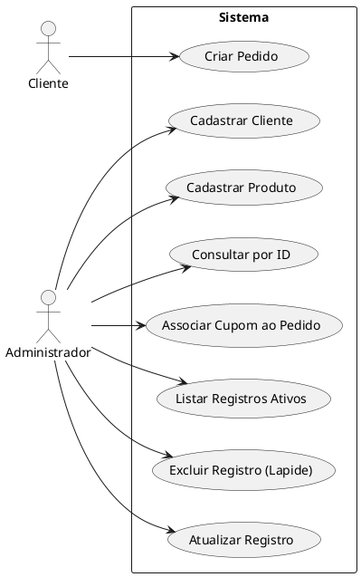

# Diagrama de Caso de Uso (DCU)

## Atores
- Cliente: realiza pedidos.
- Administrador: gerencia cadastros, consultas, atualizacoes e exclusoes logicas.

## Casos de Uso Implementados
- RF01: Cadastrar Cliente.
- RF02: Cadastrar Produto.
- RF03: Criar Pedido (com multiplos produtos).
- RF04: Associar Cupom a Pedido.
- RF05: Listar registros ativos.
- RF06: Excluir registros (lapide).
- RF07: Atualizar registros existentes.
- RF08: Consultar registro por identificador.

## Fonte PlantUML (DCU)

