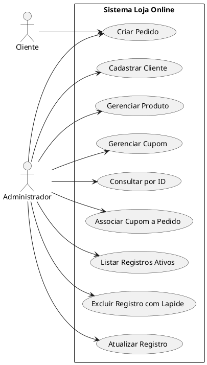

# Diagrama de Caso de Uso (DCU)

## 1. Visao geral
O Diagrama de Caso de Uso representa as funcionalidades principais da **Loja Online** conforme implementadas no projeto. O sistema possui dois atores principais: **Cliente** e **Administrador**.

## 2. Atores
- **Cliente**: participa do processo de compra, sendo o titular do pedido registrado no sistema.
- **Administrador**: utiliza a interface para cadastrar, consultar, atualizar, listar e excluir logicamente os dados do sistema.

## 3. Casos de uso representados
- Cadastrar Cliente
- Gerenciar Produto
- Gerenciar Cupom
- Criar Pedido
- Associar Cupom a Pedido
- Listar Registros Ativos
- Excluir Registro com Lapide
- Atualizar Registro
- Consultar por ID

## 4. Relacao com o projeto
No sistema implementado, o administrador realiza as operacoes pela interface web. O cliente aparece como ator de negocio porque os pedidos sao vinculados a um cliente cadastrado.

## 5. Codigo do diagrama em PlantUML

## 6. Observacoes
- O caso de uso **Criar Pedido** depende da existencia previa de cliente e produto.
- O caso de uso **Associar Cupom a Pedido** depende da existencia de um pedido e de um cupom ativo.
- O gerenciamento de produto e cupom representa o conjunto de operacoes de cadastro, atualizacao, consulta, listagem e exclusao logica disponiveis na interface.
- A interface atual do projeto nao implementa autenticacao; os atores representam papeis de negocio, nao contas de acesso.
