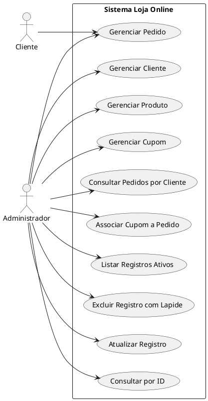

# Diagrama de Caso de Uso (DCU)

## 1. Visao geral
O Diagrama de Caso de Uso representa as funcionalidades principais da **Loja Online** conforme implementadas no projeto. O sistema possui dois atores principais: **Cliente** e **Administrador**.

## 2. Atores
- **Cliente**: participa do processo de compra, sendo o titular do pedido registrado no sistema.
- **Administrador**: utiliza a interface para cadastrar, consultar, atualizar, listar e excluir logicamente os dados do sistema.

## 3. Casos de uso representados
- Gerenciar Cliente
- Gerenciar Produto
- Gerenciar Cupom
- Gerenciar Pedido
- Associar Cupom a Pedido
- Listar Registros Ativos
- Excluir Registro com Lapide
- Atualizar Registro
- Consultar por ID
- Consultar Pedidos por Cliente

## 4. Relacao com o projeto
No sistema implementado, o administrador realiza as operacoes pela interface web. O cliente aparece como ator de negocio porque os pedidos sao vinculados a um cliente cadastrado.

## 5. Codigo do diagrama em PlantUML

```plantuml
@startuml
left to right direction

actor Cliente
actor Administrador

rectangle "Sistema Loja Online" {
  usecase "Gerenciar Cliente" as UC1
  usecase "Gerenciar Produto" as UC2
  usecase "Gerenciar Cupom" as UC3
  usecase "Gerenciar Pedido" as UC4
  usecase "Associar Cupom a Pedido" as UC5
  usecase "Listar Registros Ativos" as UC6
  usecase "Excluir Registro com Lapide" as UC7
  usecase "Atualizar Registro" as UC8
  usecase "Consultar por ID" as UC9
  usecase "Consultar Pedidos por Cliente" as UC10
}

Cliente --> UC4

Administrador --> UC1
Administrador --> UC2
Administrador --> UC3
Administrador --> UC4
Administrador --> UC5
Administrador --> UC6
Administrador --> UC7
Administrador --> UC8
Administrador --> UC9
Administrador --> UC10
@enduml
```

## 6. Observacoes
- O caso de uso **Gerenciar Cliente** representa cadastro, consulta, atualizacao, listagem e exclusao logica dos clientes.
- O caso de uso **Gerenciar Produto** representa cadastro, consulta, atualizacao, listagem e exclusao logica dos produtos.
- O caso de uso **Gerenciar Cupom** representa cadastro, consulta, atualizacao, listagem e exclusao logica dos cupons.
- O caso de uso **Gerenciar Pedido** representa criacao, consulta, atualizacao, listagem e exclusao logica dos pedidos.
- O fluxo de **Gerenciar Pedido** depende da existencia previa de cliente e produto.
- O caso de uso **Associar Cupom a Pedido** depende da existencia de um pedido e de um cupom ativo.
- O caso de uso **Consultar Pedidos por Cliente** representa a navegacao do relacionamento `Cliente 1:N Pedido`.
- A interface atual do projeto nao implementa autenticacao; os atores representam papeis de negocio, nao contas de acesso.
