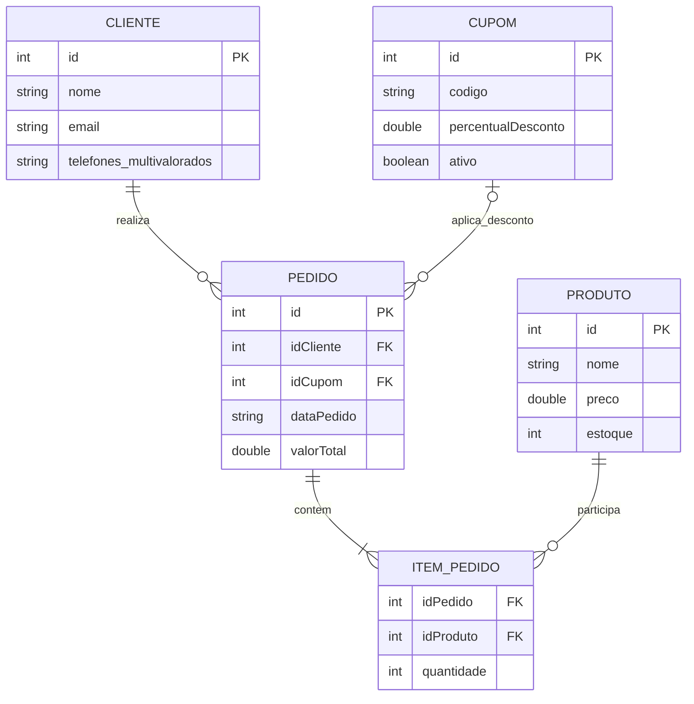

# Diagrama Entidade-Relacionamento (DER)

## 1. Visao geral
O DER abaixo representa as entidades persistidas e os relacionamentos logicos utilizados no projeto **Loja Online**. Embora os dados sejam armazenados em arquivos binarios, a modelagem conceitual segue a estrutura de entidades e relacionamentos.

## 2. Entidades do projeto
- **Cliente**
  - `id`
  - `nome`
  - `email`
  - `telefones[]`
- **Produto**
  - `id`
  - `nome`
  - `preco`
  - `estoque`
- **Cupom**
  - `id`
  - `codigo`
  - `percentualDesconto`
  - `ativo`
- **Pedido**
  - `id`
  - `idCliente`
  - `idCupom`
  - `dataPedido`
  - `valorTotal`
- **ItemPedido** (entidade conceitual derivada da estrutura interna do pedido)
  - `idPedido`
  - `idProduto`
  - `quantidade`

## 3. Relacionamentos
- Um **Cliente** pode realizar varios **Pedidos**.
- Um **Pedido** contem um ou varios **ItensPedido**.
- Um **Produto** pode aparecer em varios **ItensPedido**.
- Um **Pedido** pode ter zero ou um **Cupom** associado.

## 4. Regras observadas no codigo
- O pedido so pode ser criado se o cliente existir.
- O pedido precisa ter produtos e quantidades validas.
- A quantidade de cada item deve ser maior que zero.
- Os vetores de produtos e quantidades precisam ter o mesmo tamanho.
- O estoque do produto e reduzido no momento da criacao do pedido.
- O cupom so pode ser associado se existir e estiver ativo.
- Um pedido nao pode receber mais de um cupom.
- O valor total do pedido e recalculado quando um cupom e associado.

## 5. Codigo do diagrama em Mermaid

## 6. Observacao importante
Na implementacao real, `ItemPedido` nao existe como classe separada. Os itens do pedido sao armazenados dentro da propria classe `Pedido`, por meio de dois vetores: um para IDs de produtos e outro para quantidades. Mesmo assim, para fins de modelagem, a entidade `ItemPedido` representa corretamente o relacionamento entre `Pedido` e `Produto`.
