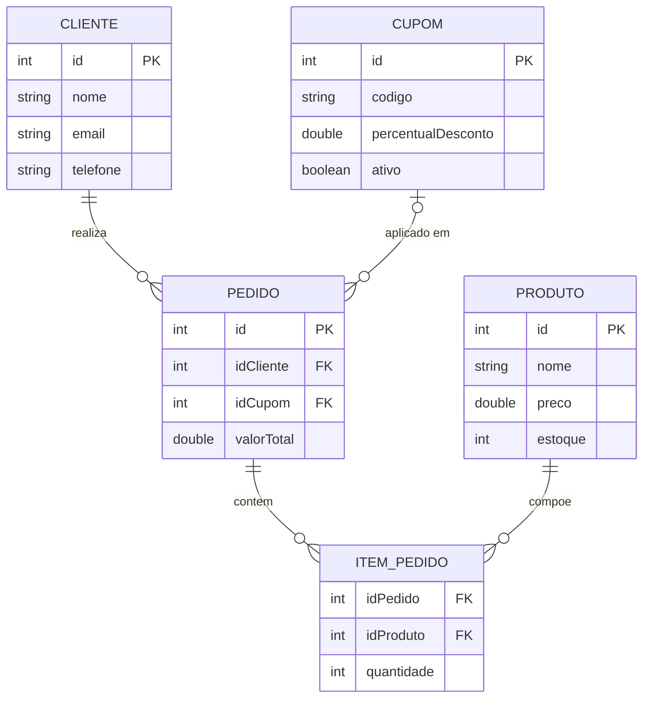

# Diagrama Entidade-Relacionamento (DER)

## Entidades
- Cliente(id, nome, email, telefone)
- Produto(id, nome, preco, estoque)
- Cupom(id, codigo, percentualDesconto, ativo)
- Pedido(id, idCliente, idCupom, valorTotal)
- ItemPedido(idPedido, idProduto, quantidade)

## Relacionamentos
- Cliente 1:N Pedido
- Pedido N:N Produto (resolvido por ItemPedido)
- Pedido 0:1 Cupom

## Regras de Integridade
- Um pedido precisa de um cliente valido.
- Um pedido deve possuir ao menos um item.
- Quantidade de item deve ser > 0.
- Estoque do produto e baixado na criacao do pedido.
- Cupom so pode ser associado se estiver ativo.

## Fonte Mermaid (DER)

