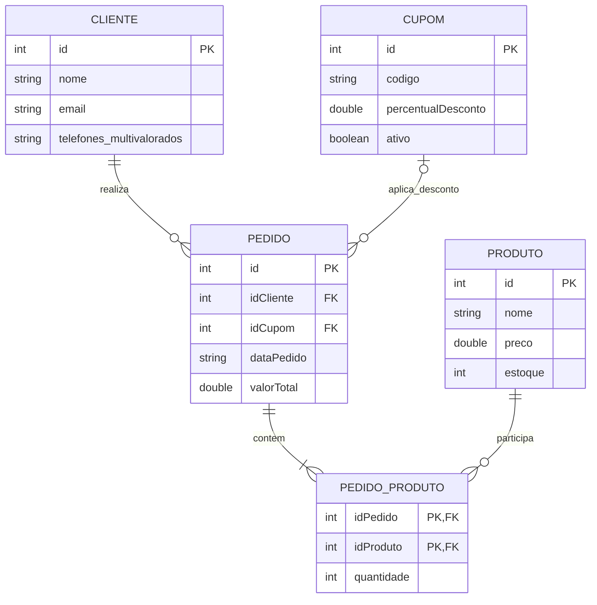

# Diagrama Entidade-Relacionamento (DER)

## 1. Visao geral
O DER abaixo representa as entidades persistidas e os relacionamentos logicos utilizados no projeto **Loja Online**. Embora os dados sejam armazenados em arquivos binarios, a modelagem conceitual segue a estrutura de entidades e relacionamentos.

## 2. Entidades do projeto
- **Cliente**
  - `id`
  - `nome`
  - `email`
  - `telefones[]`
- **Produto**
  - `id`
  - `nome`
  - `preco`
  - `estoque`
- **Cupom**
  - `id`
  - `codigo`
  - `percentualDesconto`
  - `ativo`
- **Pedido**
  - `id`
  - `idCliente`
  - `idCupom`
  - `dataPedido`
  - `valorTotal`
- **PedidoProduto** (tabela associativa persistida)
  - `idPedido` (PK, FK)
  - `idProduto` (PK, FK)
  - `quantidade`

## 3. Relacionamentos
- Um **Cliente** pode realizar varios **Pedidos**.
- Um **Pedido** contem um ou varios **ItensPedido**.
- Um **Produto** pode aparecer em varios **ItensPedido**.
- Um **Pedido** pode ter zero ou um **Cupom** associado.

## 4. Regras observadas no codigo
- O pedido so pode ser criado se o cliente existir.
- O pedido precisa ter produtos e quantidades validas.
- A quantidade de cada item deve ser maior que zero.
- A chave composta impede mais de um item para o mesmo par pedido/produto.
- O estoque do produto e reduzido no momento da criacao do pedido.
- O cupom so pode ser associado se existir e estiver ativo.
- Um pedido nao pode receber mais de um cupom.
- O valor total do pedido e recalculado quando um cupom e associado.

## 5. Codigo do diagrama em Mermaid

```mermaid
erDiagram
    CLIENTE ||--o{ PEDIDO : realiza
    PEDIDO ||--|{ PEDIDO_PRODUTO : contem
    PRODUTO ||--o{ PEDIDO_PRODUTO : participa
    CUPOM o|--o{ PEDIDO : aplica_desconto

    CLIENTE {
        int id PK
        string nome
        string email
        string telefones_multivalorados
    }

    PRODUTO {
        int id PK
        string nome
        double preco
        int estoque
    }

    CUPOM {
        int id PK
        string codigo
        double percentualDesconto
        boolean ativo
    }

    PEDIDO {
        int id PK
        int idCliente FK
        int idCupom FK
        string dataPedido
        double valorTotal
    }

    PEDIDO_PRODUTO {
        int idPedido PK, FK
        int idProduto PK, FK
        int quantidade
    }
```

## 6. Refinamento para a Fase III
- O atributo de contato de `Cliente` foi refinado para `telefones_multivalorados`, refletindo o armazenamento de varios telefones.
- A entidade `Pedido` foi refinada com o atributo `dataPedido`, presente na implementacao.
- O relacionamento `Cliente 1:N Pedido` e acessado na implementacao por meio de hash extensivel, embora isso nao altere a notacao conceitual do DER.
- A entidade `PedidoProduto` agora existe fisicamente em `data/pedido_produto.db`, com registros contendo cabecalho, lapide e payload.
- O acesso nos dois sentidos e mantido por indices B+ de chaves compostas em ordens opostas.
