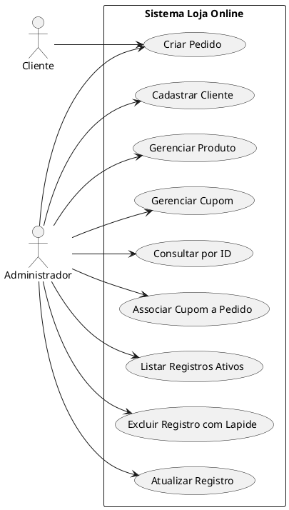
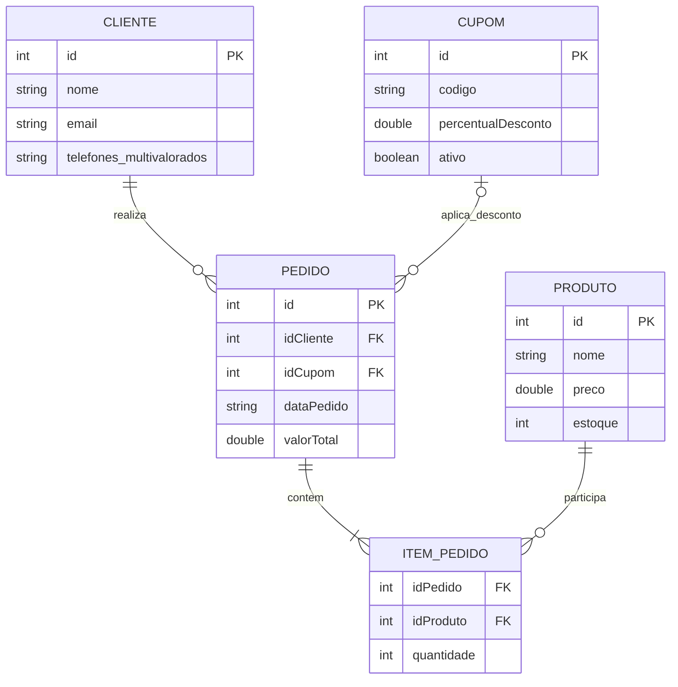
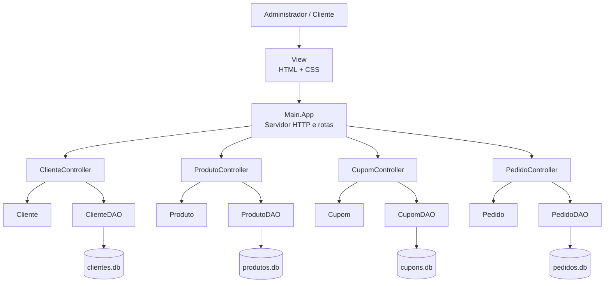

# Documentacao Completa - Loja Online

## 1. Descricao do problema
O sistema desenvolvido representa uma **Loja Online** capaz de cadastrar e gerenciar clientes, produtos, pedidos e cupons. O objetivo e controlar o fluxo basico de vendas, permitindo registrar clientes, manter um catalogo de produtos, criar pedidos com varios itens e aplicar cupons promocionais.

Os dados do sistema sao persistidos em **arquivos binarios com cabecalho**, sem uso de banco de dados relacional, e a exclusao de registros e feita por **lapide**, preservando os dados fisicamente no arquivo.

O projeto contem:
- campo de data no pedido (`dataPedido`)
- campos reais (`preco`, `percentualDesconto`, `valorTotal`)
- campos string (`nome`, `email`, `codigo`)
- campo string multivalorado no cliente (`telefones`)

## 2. Objetivo do trabalho
- Desenvolver um sistema com operacoes de cadastro, consulta, atualizacao, listagem e exclusao logica para clientes, produtos e cupons.
- Persistir os dados em arquivos binarios com controle de IDs.
- Seguir o padrao MVC + DAO.
- Fornecer documentacao com DCU, DER e arquitetura proposta.

## 3. Requisitos funcionais
- **RF01**: Cadastrar Cliente.
- **RF02**: Gerenciar Produtos.
- **RF03**: Gerenciar Cupons.
- **RF04**: Criar Pedido com multiplos produtos.
- **RF05**: Associar Cupom a Pedido.
- **RF06**: Listar registros ativos.
- **RF07**: Excluir registros com lapide.
- **RF08**: Consultar registro por identificador.

## 4. Requisitos nao funcionais
- **RNF01**: O sistema nao utiliza console como interface de uso.
- **RNF02**: A interface foi implementada em HTML/CSS.
- **RNF03**: A persistencia e obrigatoriamente binaria, com cabecalho.
- **RNF04**: A documentacao foi entregue na pasta `docs`.
- **RNF05**: A aplicacao e exposta por HTTP local na porta `18080`.
- **RNF06**: O projeto exige ambiente Java compativel com os recursos atuais do codigo-fonte.

## 5. Atores
- **Cliente**: realiza pedidos.
- **Administrador**: gerencia cadastros, consultas, atualizacoes e exclusoes logicas.

## 6. Codigo do DCU

## 7. Codigo do DER

## 8. Arquitetura proposta
O sistema segue o padrao **MVC + DAO**:
- **Model**: classes `Cliente`, `Produto`, `Pedido`, `Cupom` e `Registro`.
- **DAO**: manipulacao de arquivos binarios com cabecalho e lapide.
- **Controller**: validacoes e regras de negocio.
- **View**: interface HTML/CSS.
- **Main**: servidor HTTP e roteamento das paginas.

## 9. Regras observadas na implementacao
- O pedido so pode ser criado para um cliente existente.
- Cada item do pedido precisa referenciar um produto existente.
- Quantidades devem ser positivas e coerentes com o estoque.
- A criacao de pedido reduz o estoque imediatamente.
- O cupom precisa existir, estar ativo e ainda nao pode haver cupom associado ao pedido.
- O valor total do pedido e recalculado no momento da associacao do cupom.
- Registros excluidos logicamente nao aparecem nas consultas de ativos.

## 10. Diagrama de arquitetura em camadas

## 11. Rotas e execucao
- Classe principal: `Main.App`
- Endereco local: `http://localhost:18080`
- Rota inicial: `GET /`
- Modulos web: `/clientes`, `/produtos`, `/cupons` e `/pedidos`
- Estilo centralizado: `/styles.css`

## 12. Observacao sobre serializacao de strings
O projeto utiliza `Util/BinaryStringIO` para gravar blocos de strings com:
- `2 bytes` para quantidade de strings;
- `4 bytes` para o tamanho UTF-8 de cada string;
- `N bytes` para o conteudo serializado.
