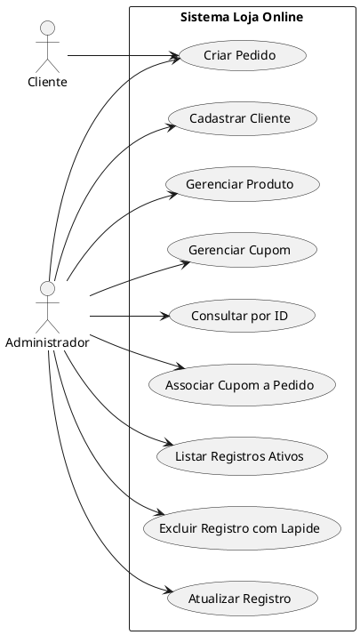
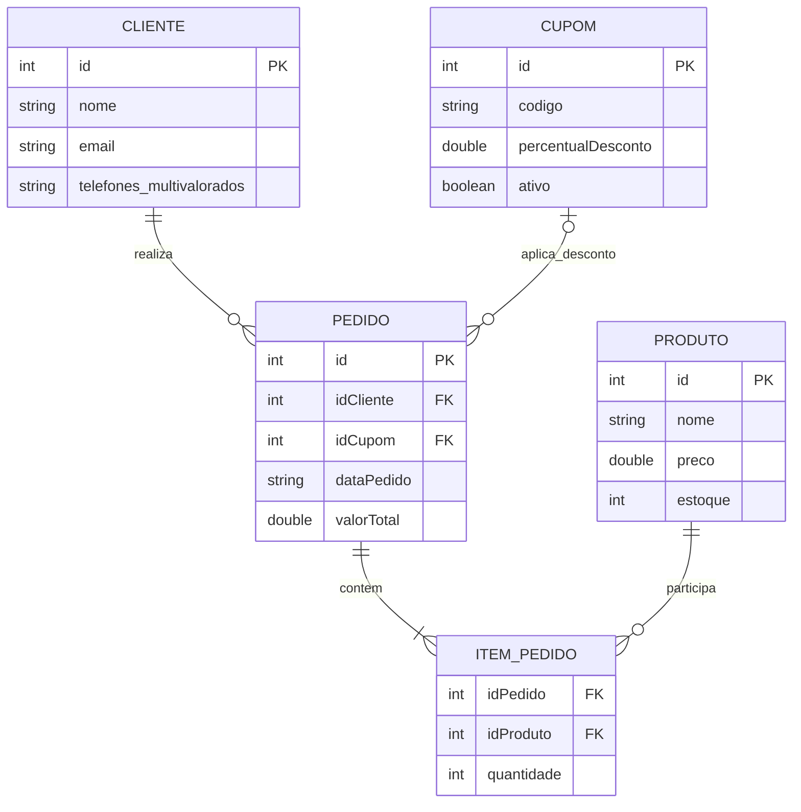
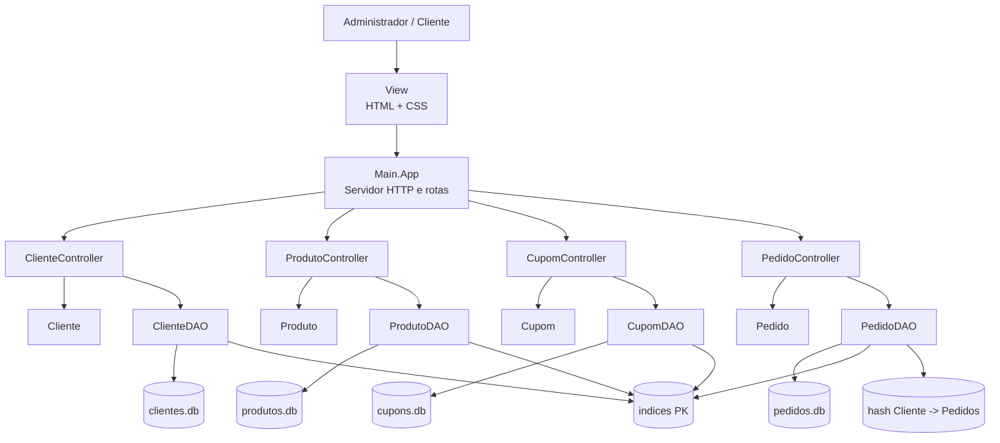

# Documentacao Completa - Loja Online

## 1. Descricao do problema
O sistema representa uma **Loja Online** capaz de cadastrar e gerenciar `Cliente`, `Produto`, `Cupom` e `Pedido`. A Fase II evolui a base da Fase I com tres pontos centrais:
- CRUD completo para todas as tabelas ja modeladas.
- Indice primario persistente para todas as entidades.
- Relacionamento `Cliente 1:N Pedido` implementado com **Hash Extensivel**.

Os dados sao mantidos em **arquivos binarios com cabecalho**, sem uso de SGBD, e a exclusao continua sendo logica, via **lapide**.

## 2. Objetivo do trabalho
- Implementar as operacoes de insercao, busca, atualizacao e exclusao logica para todas as tabelas.
- Persistir dados e indices em disco entre execucoes.
- Implementar acesso indexado por chave primaria.
- Implementar o relacionamento `1:N` entre cliente e pedidos usando hash extensivel.
- Manter a arquitetura `MVC + DAO` definida na fase anterior.
- Disponibilizar interface front-end, README e documentacao tecnica.

## 3. Requisitos funcionais atendidos
- **RF01**: Cadastrar, consultar, atualizar, excluir e listar clientes.
- **RF02**: Cadastrar, consultar, atualizar, excluir e listar produtos.
- **RF03**: Cadastrar, consultar, atualizar, excluir e listar cupons.
- **RF04**: Cadastrar, consultar, atualizar, excluir e listar pedidos.
- **RF05**: Associar cupom ativo a pedido.
- **RF06**: Navegar no relacionamento `Cliente -> Pedidos`.
- **RF07**: Recalcular estoque e valor total nas alteracoes de pedido.
- **RF08**: Persistir dados e indices em disco.

## 4. Requisitos nao funcionais atendidos
- **RNF01**: Interface front-end em HTML/CSS servida localmente por `HttpServer`.
- **RNF02**: Persistencia binaria com cabecalho, lapide e payload serializado.
- **RNF03**: Indices armazenados em arquivos proprios, separados dos dados.
- **RNF04**: Estrutura em camadas seguindo `MVC + DAO`.
- **RNF05**: Validacao de entrada e mensagens de erro para operacoes invalidas.
- **RNF06**: Aplicacao executada em `http://localhost:18080`.

## 5. Atores
- **Administrador**: gerencia cadastros, pedidos, cupons e exclusoes logicas.
- **Cliente**: entidade de dominio que participa da realizacao de pedidos.

## 6. Codigo do DCU

```plantuml
@startuml
left to right direction

actor Cliente
actor Administrador

rectangle "Sistema Loja Online" {
  usecase "Cadastrar Cliente" as UC1
  usecase "Gerenciar Produto" as UC2
  usecase "Gerenciar Cupom" as UC3
  usecase "Criar Pedido" as UC4
  usecase "Associar Cupom a Pedido" as UC5
  usecase "Listar Registros Ativos" as UC6
  usecase "Excluir Registro com Lapide" as UC7
  usecase "Atualizar Registro" as UC8
  usecase "Consultar por ID" as UC9
}

Cliente --> UC4
Administrador --> UC1
Administrador --> UC2
Administrador --> UC3
Administrador --> UC4
Administrador --> UC5
Administrador --> UC6
Administrador --> UC7
Administrador --> UC8
Administrador --> UC9
@enduml
```

## 7. Codigo do DER

```mermaid
erDiagram
    CLIENTE ||--o{ PEDIDO : realiza
    PEDIDO ||--|{ ITEM_PEDIDO : contem
    PRODUTO ||--o{ ITEM_PEDIDO : participa
    CUPOM o|--o{ PEDIDO : aplica_desconto

    CLIENTE {
        int id PK
        string nome
        string email
        string telefones_multivalorados
    }

    PRODUTO {
        int id PK
        string nome
        double preco
        int estoque
    }

    CUPOM {
        int id PK
        string codigo
        double percentualDesconto
        boolean ativo
    }

    PEDIDO {
        int id PK
        int idCliente FK
        int idCupom FK
        string dataPedido
        double valorTotal
    }

    ITEM_PEDIDO {
        int idPedido FK
        int idProduto FK
        int quantidade
    }
```

## 8. Arquitetura proposta
O sistema segue o padrao **MVC + DAO**:
- **Model**: classes `Cliente`, `Produto`, `Pedido`, `Cupom` e `Registro`.
- **DAO**: manipulacao de arquivos binarios, indice primario e relacionamento `1:N`.
- **Controller**: validacoes e regras de negocio.
- **View**: interface HTML/CSS.
- **Main**: servidor HTTP e roteamento das paginas.

## 9. Regras observadas na implementacao
- O pedido so pode ser criado para um cliente existente.
- Cada item do pedido precisa referenciar um produto existente.
- Quantidades devem ser positivas e coerentes com o estoque.
- A criacao de pedido reduz o estoque imediatamente.
- O cupom precisa existir, estar ativo e ainda nao pode haver cupom associado ao pedido.
- O valor total do pedido e recalculado no momento da associacao do cupom.
- Registros excluidos logicamente nao aparecem nas consultas de ativos.
- O relacionamento `Cliente -> Pedidos` considera apenas pedidos ativos.
- A atualizacao de pedido recompensa e reaplica estoque conforme os itens antigos e novos.

## 10. Diagrama de arquitetura em camadas

```mermaid
flowchart TD
    U[Administrador / Cliente] --> V[View<br/>HTML + CSS]
    V --> A[Main.App<br/>Servidor HTTP e rotas]

    A --> CC[ClienteController]
    A --> PC[ProdutoController]
    A --> CuC[CupomController]
    A --> PeC[PedidoController]

    CC --> M1[Cliente]
    PC --> M2[Produto]
    CuC --> M3[Cupom]
    PeC --> M4[Pedido]

    CC --> D1[ClienteDAO]
    PC --> D2[ProdutoDAO]
    CuC --> D3[CupomDAO]
    PeC --> D4[PedidoDAO]

    D1 --> F1[(clientes.db)]
    D2 --> F2[(produtos.db)]
    D3 --> F3[(cupons.db)]
    D4 --> F4[(pedidos.db)]
    D1 --> I1[(indices PK)]
    D2 --> I1
    D3 --> I1
    D4 --> I1
    D4 --> R1[(hash Cliente -> Pedidos)]
```

## 11. Rotas e execucao
- Classe principal: `Main.App`
- Endereco local: `http://localhost:18080`
- Rota inicial: `GET /`
- Modulos web: `/clientes`, `/produtos`, `/cupons` e `/pedidos`
- Estilo centralizado: `/styles.css`
- Compilacao recomendada neste ambiente: `javac --release 8 Main\App.java`

## 12. Observacao sobre serializacao de strings
O projeto utiliza `Util/BinaryStringIO` para gravar blocos de strings com:
- `2 bytes` para quantidade de strings;
- `4 bytes` para o tamanho UTF-8 de cada string;
- `N bytes` para o conteudo serializado.

No caso do atributo multivalorado `telefones`, o bloco contem primeiro `nome` e `email`, seguido por todos os telefones do cliente.

## 13. Estruturas de dados e indices

### 13.1 Arquivos de dados
Cada arquivo principal (`clientes.db`, `produtos.db`, `cupons.db`, `pedidos.db`) segue o formato:
- `int`: ultimo ID gerado.
- Para cada registro:
- `boolean`: lapide (`false` = ativo, `true` = excluido logicamente).
- `int`: tamanho do payload.
- `byte[]`: payload serializado da entidade.

### 13.2 Indice primario por tabela
Cada tabela possui dois arquivos de indice:
- `*.pk.dir.db`: diretorio do hash extensivel.
- `*.pk.buckets.db`: buckets do hash extensivel.

A chave usada e sempre a **PK inteira** da entidade, e o valor armazenado e a **posicao do registro no arquivo de dados**.

Formato do diretorio:
- `int`: profundidade global.
- `int`: capacidade do bucket.
- `long[]`: ponteiros para buckets.

Formato de cada bucket:
- `int`: profundidade local.
- `int`: quantidade de entradas ativas no bucket.
- Para cada posicao do bucket:
- `boolean`: entrada ativa.
- `int`: chave.
- `long`: endereco associado.

### 13.3 Relacionamento 1:N com hash extensivel
O relacionamento `Cliente 1:N Pedido` foi implementado com tres arquivos:
- `pedidos.db.cliente_pedidos.dir.db`
- `pedidos.db.cliente_pedidos.buckets.db`
- `pedidos.db.cliente_pedidos.list.db`

Nos arquivos `.dir.db` e `.buckets.db`, a chave e `idCliente` e o valor e um ponteiro para o inicio de uma lista invertida em `list.db`.

Formato da lista invertida:
- `int`: `idPedido`
- `long`: ponteiro para o proximo no encadeamento, ou `-1`.

## 14. Navegacao do relacionamento 1:N
O acesso ao relacionamento ocorre assim:
1. O sistema recebe um `idCliente`.
2. O hash extensivel localiza rapidamente o bucket e retorna o ponteiro do cliente na lista invertida.
3. A lista invertida fornece os `idPedido` vinculados ao cliente.
4. Cada `idPedido` e consultado no indice primario de `Pedido`, chegando ao registro completo em `pedidos.db`.
5. Pedidos excluidos logicamente nao retornam na navegacao.

Esse modelo separa bem a chave estrangeira da tabela principal e evita varredura sequencial em todos os pedidos quando a interface pede "listar pedidos do cliente".

## 15. Integridade referencial
- Um pedido so e criado se o `Cliente` existir.
- Um pedido so aceita `Produto` existente.
- O estoque e validado antes da gravacao e atualizado apos a confirmacao da operacao.
- O cupom so e associado ou mantido na atualizacao quando existir e estiver ativo.
- Quando um pedido e alterado ou excluido logicamente, o indice do relacionamento e sincronizado.

## 16. Respostas ao formulario do projeto

### a) Qual a estrutura usada para representar os registros?
Os registros foram representados por classes de dominio (`Cliente`, `Produto`, `Cupom`, `Pedido`) que implementam a interface `Registro`. Cada objeto sabe serializar e desserializar seu proprio payload binario com `toByteArray()` e `fromByteArray()`.

### b) Como atributos multivalorados do tipo string foram tratados?
O atributo `telefones` de `Cliente` foi tratado como `String[]`. Na serializacao, todas as strings sao gravadas em um bloco binario usando `BinaryStringIO`, o que permite quantidade variavel de telefones por cliente.

### c) Como foi implementada a exclusao logica?
Cada registro possui uma lapide `boolean` no arquivo. Ao excluir, o sistema apenas marca a lapide como `true`, removendo o registro dos indices e das listagens, mas sem apagar fisicamente o payload do arquivo.

### d) Alem das PKs, quais outras chaves foram utilizadas nesta etapa?
Foi utilizada a chave estrangeira `idCliente` em `Pedido` para implementar o relacionamento `1:N` com hash extensivel. O campo `idCupom` tambem e usado em validacoes de integridade do pedido.

### e) Como a estrutura (hash) foi implementada para cada chave de pesquisa?
Para as PKs, o hash extensivel armazena `PK -> endereco do registro`. Para o relacionamento `1:N`, o hash extensivel armazena `idCliente -> ponteiro para lista invertida de pedidos`. O crescimento dos buckets acontece por divisao, com profundidade global e local persistidas em disco.

### f) Como foi implementado o relacionamento 1:N?
Cada `Pedido` guarda a FK `idCliente`. Em paralelo, existe um indice em hash extensivel que localiza, a partir do cliente, o inicio de uma lista invertida com os IDs de seus pedidos. A navegacao vai do cliente para a lista de IDs e depois para o indice primario de `Pedido`. A integridade referencial e garantida validando a existencia do cliente antes de criar ou atualizar pedidos.

### g) Como os indices sao persistidos em disco?
Os indices ficam em arquivos binarios separados dos dados. O diretorio do hash guarda profundidade global e ponteiros para buckets. Os buckets guardam profundidade local, quantidade de entradas e pares chave/endereco. No relacionamento, o valor do hash aponta para uma lista invertida persistida em outro arquivo. Os indices sao atualizados nas operacoes de `create`, `update` e `delete`, e tambem podem ser reconstruidos a partir dos dados ativos na inicializacao.

### h) Como esta estruturado o projeto no GitHub?
O repositorio esta separado por camadas: `Model`, `DAO`, `Controller`, `View`, `Main`, `Util`, `docs` e `data`. A aplicacao usa arquitetura `MVC + DAO`, isolando regras de negocio, persistencia, entidades e interface web.

## 17. Links para a entrega final
- Repositorio GitHub do grupo: `SUBSTITUIR_PELO_LINK_REAL`
- Video explicativo: `SUBSTITUIR_PELO_LINK_REAL`
