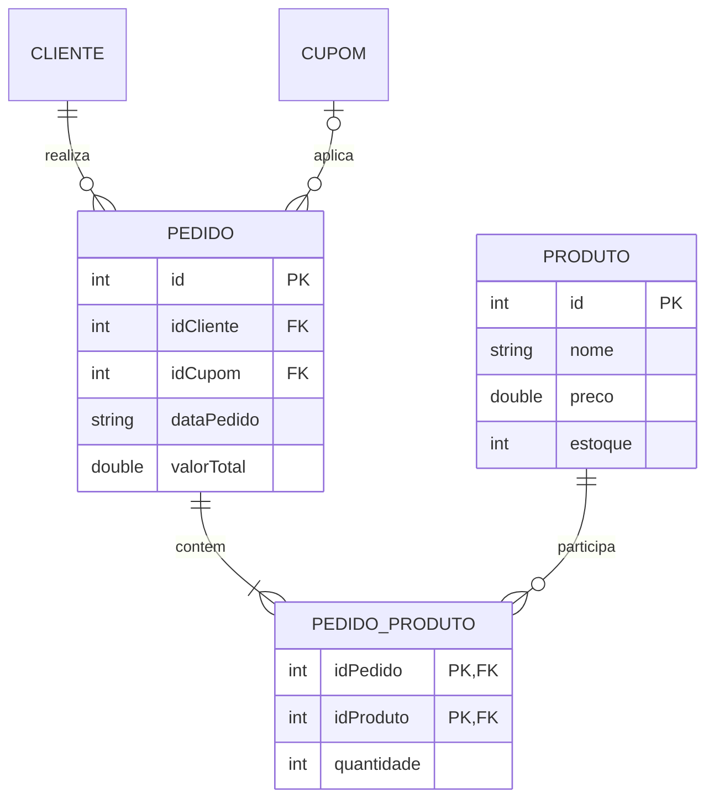

# Loja Online - Relatorio Tecnico da Fase III

## 1. Identificacao e objetivo

Aplicacao: **Loja Online**  
Arquitetura: **MVC + DAO**, Java e interface web local  
Persistencia: arquivos binarios com cabecalho e exclusao logica por lapide

Esta fase continua o sistema das Fases I e II implementando o relacionamento
`Pedido N:N Produto` por uma tabela associativa real e demonstrando o uso
pratico de uma **Arvore B+** em consultas ordenadas persistentes.

## 2. Funcionalidades implementadas

- CRUD web das entidades `Cliente`, `Produto`, `Cupom` e `Pedido`, mantido.
- Tabela `PedidoProduto`, que armazena os itens de pedido.
- Chave primaria composta `(idPedido, idProduto)`.
- Consulta de produtos pertencentes a um pedido em `/pedidos`.
- Consulta de pedidos que contem determinado produto em `/pedidos`.
- Listagem de produtos ativos ordenada por ID em `/produtos`, lida pelas
  folhas da Arvore B+, sem ordenar uma lista na memoria principal.
- Migracao automatica dos itens legados embutidos em pedidos antigos ao
  iniciar a aplicacao.

## 3. Modelo de dados



`PedidoProduto` substitui a representacao fisica antiga baseada em vetores
no registro de `Pedido`. Novos pedidos gravam seus itens somente na tabela
associativa; os vetores permanecem na classe `Pedido` para compatibilidade de
leitura dos arquivos produzidos nas fases anteriores.

## 4. Persistencia e indices

### 4.1 Arquivo associativo

Arquivo: `data/pedido_produto.db`

Formato:

```text
[cabecalho int: total de insercoes]
[lapide boolean][tamanho int][idPedido int][idProduto int][quantidade int]
...
```

O cabecalho de quatro bytes e a lapide seguem o mesmo padrao fisico usado
pelas entidades existentes. A remocao de um item apenas marca a lapide; os
indices passam a considerar somente registros ativos.

### 4.2 Chave composta

A PK logica e composta exatamente pelas duas FKs:

```text
(idPedido, idProduto)
```

Para indexacao, os dois inteiros sao codificados sem perda em uma chave
`long`: os 32 bits superiores guardam `idPedido` e os 32 inferiores guardam
`idProduto`. A ordem lexicografica resultante permite recuperar todos os
itens de um pedido por intervalo contiguo na B+.

### 4.3 Arvores B+

Os indices criados sao:

| Arquivo | Chave | Uso |
| --- | --- | --- |
| `pedido_produto.db.pedido.bplus.db` | `(idPedido, idProduto)` | Produtos de um pedido |
| `pedido_produto.db.produto.bplus.db` | `(idProduto, idPedido)` | Pedidos de um produto |
| `produtos.db.ordem_id.bplus.db` | `idProduto` | Catalogo em ordem de ID |

A implementacao em `DAO/BPlusTreeIndex.java` persiste paginas internas e
folhas. As folhas possuem ponteiro para a proxima folha; por isso a listagem
ordenada percorre o proprio indice e nao utiliza `sort`, `Collections.sort`
ou ordenacao equivalente na memoria principal.

### 4.4 Hash extensivel existente

O hash extensivel continua apropriado para pesquisa pontual por chave
primaria (`id -> endereco`) e para a navegacao preexistente
`Cliente -> Pedidos`. A B+ foi acrescentada onde o requisito e a recuperacao
ordenada ou por intervalo de chave composta.

## 5. Integridade referencial e CRUD

- Ao criar um pedido, o controller valida cliente, produtos, quantidades e
  estoque; depois grava uma linha `PedidoProduto` para cada produto.
- Ao atualizar um pedido, os itens ativos antigos sao lidos da tabela
  associativa, o estoque e recalculado e as associacoes anteriores recebem
  lapide antes da gravacao das novas.
- Ao excluir um pedido, seus itens recebem lapide e suas quantidades sao
  devolvidas ao estoque dos produtos ainda existentes.
- Ao excluir um produto, a operacao e bloqueada quando houver associacao
  ativa com um pedido.
- A migracao inicial cria associacoes para pedidos antigos que ainda possuam
  vetores legados e nao tenham registros na tabela nova.

## 6. Interface web

A aplicacao nao usa console como interface. Ela e acessada pelo navegador em
`http://localhost:18080`.

| Rota | Demonstracao |
| --- | --- |
| `/produtos` | Listagem ordenada pela Arvore B+ |
| `/pedidos` | CRUD e exibicao dos itens vindos de `PedidoProduto` |
| `/pedidos/itens` | Consulta `Pedido -> Produtos` |
| `/pedidos/by-produto` | Consulta `Produto -> Pedidos` |

## 7. Formulario tecnico obrigatorio

### 1. Qual foi o relacionamento N:N escolhido e quais tabelas ele conecta?

Foi escolhido o relacionamento **Pedido N:N Produto**. Ele conecta a tabela
principal `Pedido` a tabela principal `Produto` por meio da tabela
intermediaria persistida `PedidoProduto`.

### 2. Qual estrutura de indice foi utilizada (B+ ou Hash Extensivel)? Justifique a escolha.

Para a nova tabela e para a consulta ordenada foi utilizada a **Arvore B+**.
Ela foi escolhida porque as chaves compostas com o mesmo primeiro componente
ficam contiguas: e eficiente listar todos os produtos de um pedido ou todos
os pedidos de um produto por intervalo. Suas folhas encadeadas tambem
atendem diretamente a exigencia de recuperar produtos em ordem sem ordenar
em memoria. O hash extensivel das fases anteriores foi mantido nas buscas
pontuais por ID, onde acesso direto e a necessidade predominante.

### 3. Como foi implementada a chave composta da tabela intermediaria?

`PedidoProduto` armazena `idPedido` e `idProduto`, e o par e a chave
primaria. O DAO rejeita nova insercao quando esse par ativo ja existe. No
indice B+, os dois valores inteiros sao empacotados em um `long`, mantendo
unicidade e ordenacao do par sem criar ID artificial.

### 4. Como e feita a busca eficiente de registros por meio do indice?

Para `Pedido -> Produtos`, a B+ pesquisa o intervalo entre
`(idPedido, 0)` e `(idPedido, Integer.MAX_VALUE)`. Para
`Produto -> Pedidos`, usa o indice reverso no intervalo equivalente com
`idProduto` na primeira posicao. Para o catalogo ordenado, o sistema percorre
as folhas encadeadas de `produtos.db.ordem_id.bplus.db`.

### 5. Como o sistema trata a integridade referencial (remocao/atualizacao) entre as tabelas?

Criacao e atualizacao de pedido exigem cliente e produtos existentes e
estoque suficiente. A atualizacao substitui logicamente os itens da
associacao e ajusta estoque. A exclusao de pedido aplica lapide nos itens e
recompoe o estoque. A exclusao de produto e recusada se o produto participar
de item ativo.

### 6. Como foi organizada a persistencia dos dados dessa nova tabela?

`pedido_produto.db` possui cabecalho `int`, seguido de registros formados por
lapide `boolean`, tamanho `int` e payload com os tres inteiros da associacao.
Os indices B+ ficam em arquivos separados e sao reconstruidos a partir dos
registros ativos na inicializacao.

### 7. Como o codigo da tabela intermediaria se integra com o CRUD das tabelas principais?

`PedidoController` chama `PedidoProdutoDAO` ao criar, atualizar, consultar e
excluir pedidos. `ProdutoController` consulta o mesmo DAO antes de excluir
um produto. `Main.App` exibe os itens recuperados do DAO e oferece formularios
para as consultas nos dois sentidos do relacionamento.

### 8. Como esta organizada a estrutura de diretorios e modulos no repositorio apos esta fase?

| Diretorio | Responsabilidade e alteracoes da Fase III |
| --- | --- |
| `Model/` | Entidades, incluindo `PedidoProduto.java` |
| `DAO/` | DAOs, `PedidoProdutoDAO.java` e `BPlusTreeIndex.java` |
| `Controller/` | Integridade e operacoes N:N em pedidos/produtos |
| `Main/` | Rotas HTTP e formularios das consultas |
| `View/` | Layout HTML/CSS reutilizado pela interface web |
| `Util/` | Serializacao auxiliar |
| `data/` | Arquivos binarios criados durante a execucao |
| `docs/` | Relatorio e diagramas |

## 8. Compilacao e demonstracao

```powershell
New-Item -ItemType Directory -Force out\classes | Out-Null
$sources = Get-ChildItem -Recurse -Filter *.java -Path Controller,DAO,Main,Model,Util,View | ForEach-Object { $_.FullName }
javac --release 8 -d out\classes $sources
java -cp out\classes Main.App
```

No navegador, cadastrar ou utilizar registros existentes, criar um pedido
com produtos, consultar os dois sentidos do N:N em `/pedidos` e abrir
`/produtos` para demonstrar a recuperacao ordenada via B+.

## 9. Links da entrega

- GitHub: <https://github.com/lucaszanfa/Tp-Aedes3>
- Video explicativo da Fase I: <https://www.youtube.com/watch?v=o_7LNxR3HZc>
- Video explicativo da Fase II: <https://www.youtube.com/watch?v=3b0R70VgKEw>
- Video explicativo da Fase III: <https://www.youtube.com/watch?v=KkgcpoEBV88>

## 10. Conclusao

A Fase III torna real a associacao antes apenas conceitual entre pedidos e
produtos. A tabela intermediaria possui PK composta, persistencia com lapide,
navegacao nos dois sentidos e integridade integrada ao CRUD. A Arvore B+
persistente e demonstrada na interface pela recuperacao ordenada do catalogo
e tambem sustenta as buscas por intervalo da nova associacao.
